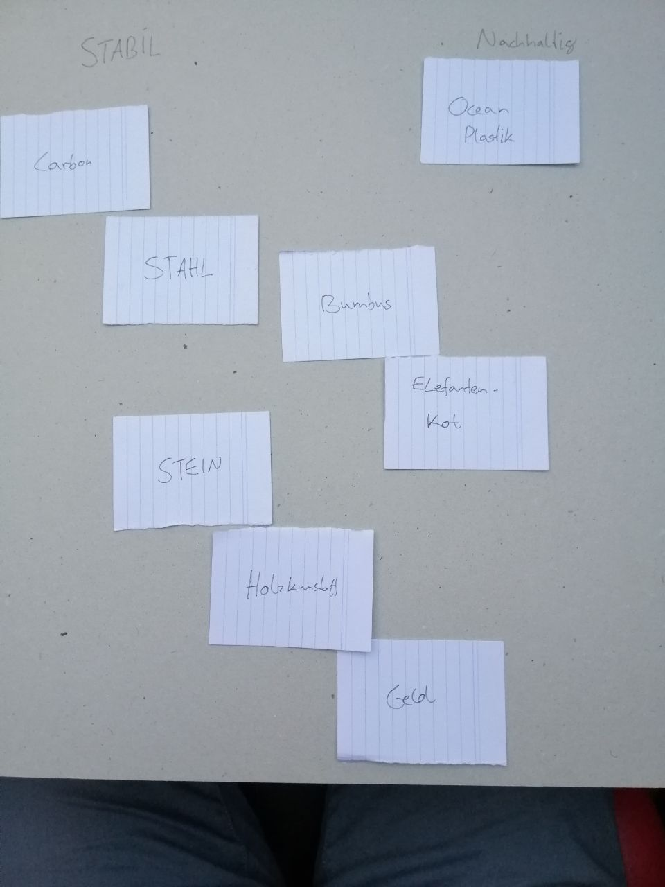
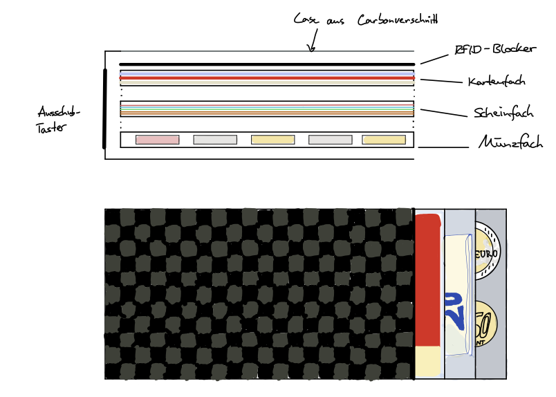
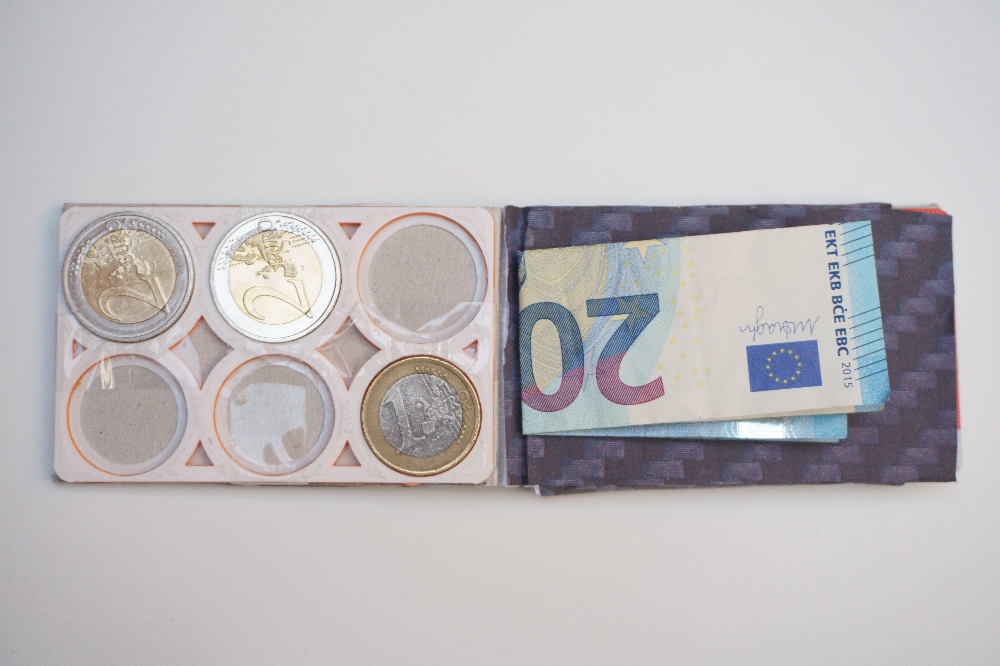

<body>
<H1> Konzept Aufgabe #01</H1>

<H2>1. Empathize</H2>

Zielgruppe: Mein Mitbewohner, 21, WING-Student

<H3>Contextual-Enquiry-Fragen</H3>
<ul>
    <li>Wann verwendest Du einen Geldbeutel?</li>
    <li>Wie verstaust Du deinen Geldbeutel am liebsten?</li>
    <li>Was sind die wichtigsten 3 Dinge in Deinem Geldbeutel?</li>
    <li>Magst Du es lieber minimalistisch oder Geräumig?</li>
    <li>Welche haptischen Merkmale machen einen guten Geldbeutel aus?</li>
    <li>Gibt es noch etwas, dass dir bei Geldbeuteln besonders wichtig ist?</li>
</ul>
<H2>2. Define</H2>

Top-Findings

<a href="https://www.youtube.com/watch?v=NFP_E--Ouzo&feature=youtu.be" target="_blank">Zum Video</a>
<ul>
    <li>Benutzt seinen Geldbeutel hauptsächlich beim Tanken, Getränkeautomat, Wenn er einen Ausweis braucht
    </li>
    <li>Geldbeutel in vorderer Hosentasche oder in die Jackentasche</li>
    <li>Wichtigsten 3 Dinge im Geldbeutel: Ausweis, Bankkarte, Bargeld</li>
    <li>Haptik: Stabil, nicht zu weich</li>
    <li>Wünscht sich mehr Geldbeutel aus Lederalternativen</li>
</ul>

Point of View:

<blockquote>"Idealerweise hätte ich gerne einen Geldbeutel der nach 10 Jahren auch noch gut aussieht und vielleicht nach
    20 auch noch."
</blockquote>
<H2>3. Ideate</H2>

<H2>4. Prototype</H2>

<H2>5. Test</H2>

Feedback:

<ul>
    <li>Carbonverschnitt ist eine gute Idee</li>
    <li>Scheinfach soll einfacher zu bedienen sein und die Scheine sollen nicht geknickt werden.</li>
    <li>Münzfach ist gut</li>
    <li>Kartenfach ist gut soll Platz für 5 Karten bieten</li>
</ul>
<H2>Prototype Iteration</H2>

</body>
</html>