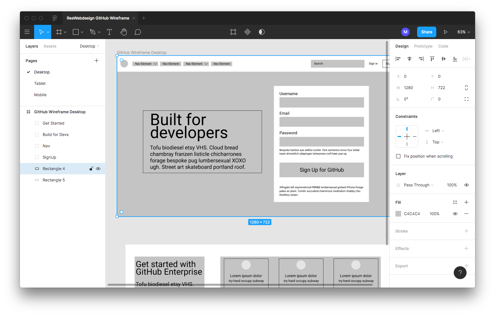
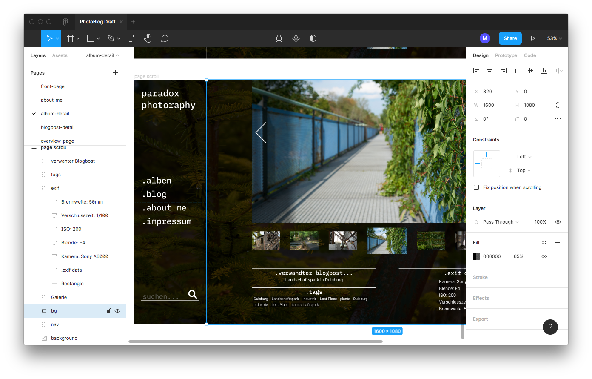

# Prototyping-Tool Vorstellung Figma
#### von Mike Blank und Yannis Friedrich
---

## Allgemeine Punkte zu Figma
### USP: 
Figma bietet sowohl ein Design-Tool als auch ein Prototyping-Tool, die integrativ verwendet werden können und eignet sich sehr gut zum kollaborativen Arbeiten. Die Basisvariante ist kostenlos.

### Kernfeatures:
* UI-Elemente lassen sich einfach grafisch verknüpfen
* Interaktionen anlegen
* Momentum Scrolling support
* Animated GIFs
* Shareable Prototyp
* Comments beim Prototypen tauchen auch im Design-File auf
* Präsentationen erstellen
* Prototypen für andere Software exportieren
* Liefert nützliche Spezifikationen zur Umsetzung des Codes'

## Fidelity
Figma eignet sich sowohl für Low- als auch High-Fidelity Anwendungen. So können vom Wireframing über das UI-Design bis hin zur Erstellung eines Prototypen alle Aufgaben Colaborativ in Figma erledigt werden.

In Figma können durchaus Prototypen mit hohem Reifegrad erstellt werden, also z.B. Simulierte Apps inklusive Animationen etc. Diese Funktionalität ist jedoch optional, man muss also keinen derart Ausgefeilten Prototypen erstellen und kann sich auch nur auf rudimentäre Kern Features der Anwendung konzentrieren und diese Später ausbauen. Somit ist Figma für den Prototypen weg vom Low- zum High-Fidelity Prototypen geeignet. Dies gilt sowohl für Interaktion mit dem Prototypen als auch dem Visuellen Reifegrad. Wie bereits oben erwähnt können sowohl einfache Wireframes in Graustufen erstellt werden als auch komplexe, bereits fertig ausgefeilte UI’s.

### Wireframe:

### Design:

Auch kollaborative Inhaltsentwicklung ist mit Figma möglich, ist jedoch sicher nicht der Hauptfokus dieses Tools. So ist es möglich direkt echte Inhalte in die Designs einzubauen und durch Strukturiert aufgebaute Designs einzelne Bestandteile zu kopieren und so beispielsweise ein Layout zusammen zu bauen und mit Inhalt zu füllen jedoch sind dies keine Features die speziell für diesen Zweck entwickelt bzw. angedacht waren. Diese Aufgabe sollte bei komplexeren Projekten, wie beispielsweise einer Corperate Webseite, in andere Tools ausgelagert werden bzw. getrennt vom Designprozess von einem Texter unter Berücksichtigung des Designs übernommen werden.

## Komplexität
Die grafische Benutzeroberfläche ist simpel aufgebaut: Man findet sich leicht zurecht und kann einfach zwischen Design und Prototyping hin- und herspringen. Falls man entsprechende Ambitionen hegt, kann man durchaus auch tiefer einsteigen und durch multiple Interaktionslayer oder Momentum Scrolling sehr realitätsnahe Prototypen bauen.

## Beispiele
* [Ein Entwurf meines Persönlichen Fotoblogs (still WIP)](https://www.figma.com/file/Qr4xdt04WQbHwrTXMLNu8lxE/PhotoBlog-Draft)
* [Ein Wireframe der Startseite von GitHub, entstanden im Rahmen des Kurses Responsive Web Design](https://www.figma.com/file/uzoJcqy5o3Qx2sh6SMfozz/ResWebdesign-GitHub-Wireframe)
* [Design Entwürfe der PaceNote Webseite, entstanden im Rahmen des Kurses Responsive Web Design](https://www.figma.com/file/pN0KrXtMbOvVN23fVzvCdx/RWD-Krach)

## Grenzen und Einschränkungen von Figma
Eine entscheidende Einschränkung von Figma ist die Tatsache, dass es sich dabei um ein Webbasiertes Tool handelt. Es gibt zwar eine Desktop App diese ist jedoch als Electron-App realisiert und erfordert auch einen permanenten Internetzugang.
Außerdem gibt es nach aktuellem Stand keine offizielle Möglichkeit den Klickbaren Prototypen zu exportieren.
Ferner ist lediglich die Basisfunktionalität im “Free-Tier” enthalten, Funktionen wie unbegrenzt viele Projekte, eine unbegrenzte Versionshistorie oder auch unbegrenzt viele Bearbeiter eines Dokuments unterliegen dagegen einem monatlichen Beitrag.
