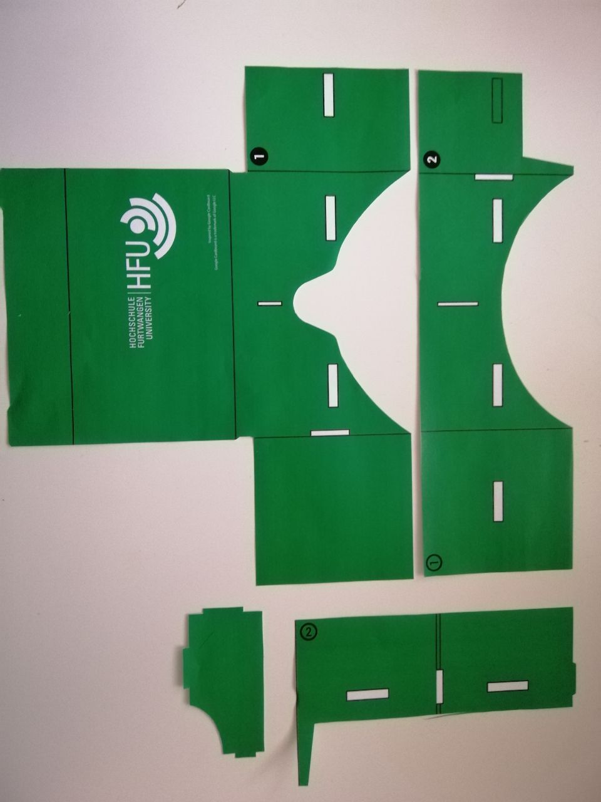

# Google Cardboard
## Eine weitere Iteration des Prototypen

Für diese Aufgabe, erfolgte der Versuch eine VR-Brille aus Pappe mit Hilfe einer Vorlage 
von Google inc. und 2 Linsen, die durch den Dozenten bereitgestellt wurden, zu bauen.
Die Papiervorlage sollte ausgedruckt und auf ein Stück Pappe geklebt werden. 
Ich führte einen Versuch direkt mit einem stärkeren Zeichenpapier durch, 
dies war jedoch sehr weich und hielt nicht gut zusammen. 
Des Weiteren erfolgte ein Versuch mit Pappe. 
Durch die vielen kleinen Kanten, war es sehr schwierig bis unmöglich, das Layout auszuschneiden. 
Das Design, welches eigentlich für außen bestimmt war, war am Ende auf der Innenseite. 
Alles in allem ein mäßiger Erfolg. Für ein schöneres Design, 
wären sicherlich noch ein bis zwei weitere Iterationen nötig.
Eien besseres Material müsste gefunden werden, die Vorlage etwas vereinfacht und die einzelnen Schritte besser abgestimmt werden. 
Positiv an den zwei Prototypen war die Tatsache, dass sich mtit beiden die Vorlesung ansehen ließ.
DIe folgenden Bilder zeigen die zwei Versuche.

## Versuch mit Papier

## Versuch mit Pappe

