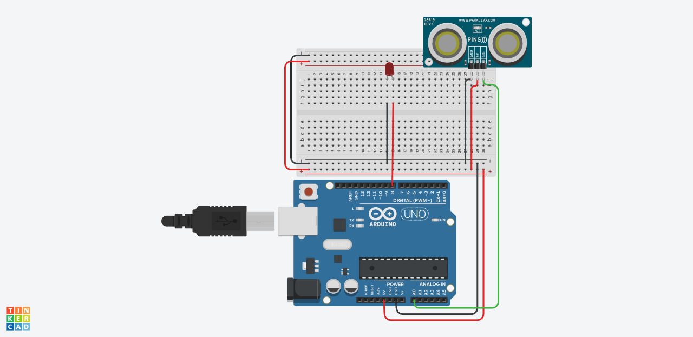

# Physical Computing
## Entwurf für ein Abstandswarnsystem

Die ist es, einen Helm mit einem LiDAR Scanner auszustatten und seitlich ein Air Horn anzubringen, dass ein Signalton erzeugt, sobald sich zwei Menschen in einem bestimmten BEreich auf der Map zu nahe kommen.
Eventuell könnte die Rotation für das LiDAR und das Air Horn vom selben Motor erzeugt werden.

## Prototypisch vereinfachte Darstellung.

In diesem Beispiel wurde mit Hilfe der Webapplikation Tinkercad ein erster Wurf skizziert. Die simulation enthält einen einfachen Ultraschallsensor und eine LED die an einem Arduino Uno angeschlossen sind.
[Link zur Tinkercad Anwendung](https://www.tinkercad.com/things/i7t4va0rYSj-dazzling-fyyran/editel?tenant=circuits?sharecode=g3IbQrOK-empH-oXlUFFOkAaqAqVtRmyLw16WhAdpgU)

